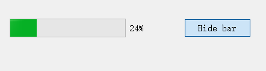
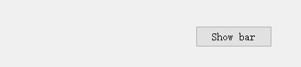
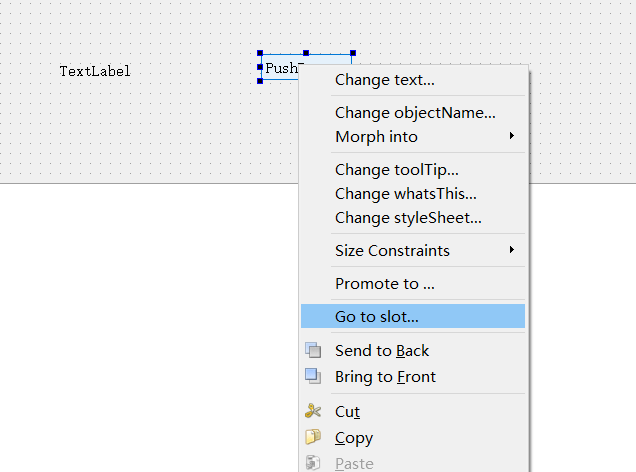
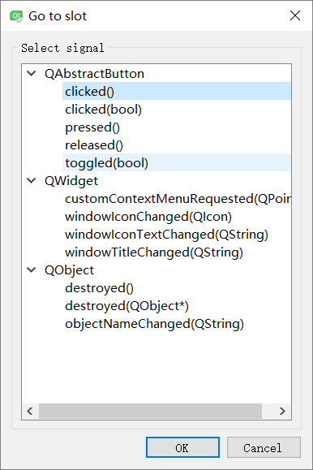

# Qt C++学习

## 1. API

### 1.1 lineEdit

```C++
    // ui->widget_object_name->setText();
    ui->lineEdit->setText("Hello My first try!");
    QLineEdit::textChanged // for signals and slots
```
普遍存在于各个控件的方法：  
.setText();  
.show();  
.resize(x, y);  

### 1.2 horizontalSlider

```C++
ui->horizontalSlider->setValue(int);
ui->horizontalSlider->setMaximum(int);
ui->horizontalSlider->setMinimum(int);
```

### 1.3 QProgresBar

```C++
progressBar->setVisible(bool);
```

### 1.4 QPushButton

```C++
pushButton->toggled(bool);
clicked(bool);
```
toggled:  
  

untoggled:  


## 2. Windows

主要分辨各个窗口的关系，三种顶层窗口。窗口下可以包含窗口，比如QWidget的子类窗口可包含button等控件。

1. QWidget：最基础的窗口，所有窗口及控件都继承QWidget。

2. QDialog：对话框窗口，可类比Windows中的对话框。

3. QMainWindow：主窗口，一般主窗口会包括标题栏，菜单栏，工具栏，中心部件，停靠窗口，状态栏等。可类比桌面应用程序。

```c++
.setGeometry(0, 0, 400, 300);  // start_x, start_y, width, height
.move(x, y);
```
### 2.1 QPushButton
< QPushButton > 头文件  
可以在实现文件(cpp)中包含，从而实现功能。

### 2.2 关于窗口的属性

#### 2.2.1 WindowsFlag
```C++
setWindowFlags(Qt::CustomizeWindowHint|Qt::WindowStaysOnTopHint);
```

如果想省点事，可以在Qt的示例程序中查找关键字“window flags example”，编译并运行程序，看每个窗口标识的作用。

Qt::Widget 默认窗口
Qt::Dialog 对话框
Qt::SplashScreen 启动窗口
常用窗口标识：

Qt::SplashScreen 在还没有展示出主界面前的启动画面
Qt::FramelessWindowHint 隐藏标题栏，并且去掉窗口的边框，窗口不能移动和缩放。
Qt::CustomizeWindowHint 隐藏标题栏，不会去掉窗口的边框，窗口不能移动，但可以缩放。
Qt::WindowStaysOnTopHint 使窗口始终处于最顶部。类似于播放器中的总在最前功能。

#### 2.2.2 窗口颜色
```C++
//设置窗口的背景颜色
setAutoFillBackground(true);
QPalette pa = this->palette();
pa.setBrush(QPalette::Background, QBrush(Qt::green));
setPalette(pa);
```

#### 2.2.3 窗口标题
```C++
//设置窗口标题
setWindowTitle("窗口属性");
```

#### 2.2.4  Others
```C++
    //设置悬停提示
    setToolTip("悬停");

    //重设大小
    resize(600, 400);

    //移动
    move(0, 0);

    setFixedSize(365,240); //将窗口设置为固定大小365*240
```

## 3 Signals and Slots, 信号和槽

### 3.1 signals
当一个对象的内部状态发生改变时，如果其它对象对它的状态需要有所反应，这时就应该让这个类发出状态改变的信号。

声明信号使用signals关键字

发送信号使用emit关键字

### 3.2 slots

### 3.3 connect function

connect 函数捕捉signals，即是在emit signals的时候，  

emit出去的signals的参数需要和slots的接受参数一样，不然无法处理。

#### 3.3.1 原型1
```C++
static QMetaObject::Connection connect(
    const QObject *sender, //信号发送对象指针
    const char *signal,    //信号函数字符串，使用SIGNAL()
    const QObject *receiver, //槽函数对象指针
    const char *member, //槽函数字符串，使用SLOT()
    Qt::ConnectionType = Qt::AutoConnection//连接类型，一般默认即可
);

//例如
connect(pushButton, SIGNAL(clicked()), dialog,  SLOT(close()));
```

#### 3.3.2 原型2 for QT5

对于函数，比如```void f();```，提取函数地址在C++中两种方法等价：
```C++
auto f_addre = f;
auto f_addre_2 = &f;
```

```C++
// & maybe wrong 
static QMetaObject::Connection connect(
    const QObject *sender, //信号发送对象指针
    const QMetaMethod &signal,//信号函数地址
    const QObject *receiver, //槽函数对象指针
    const QMetaMethod &method,//槽函数地址?
    Qt::ConnectionType type = Qt::AutoConnection//连接类型，一般默认即可
);
connect(sender, &Sender::valueChanged, receiver, &Receiver::updateValue);

//例如
connect(pushButton, QPushButton::clicked, dialog,  QDialog::close);

connect(ui->lineEdit,
        &QLineEdit::textChanged,
        this,
        &SignalsAndSlotsWidget::sltLineEditChanged);
```

#### 3.3.3 validator
QIntValidator类:提供了一个确保一个字符串包含一个在一定有效范围内的整数的验证器。

```C++
    // set QLineEdit input nums only, which ranged 0 - 100
    QIntValidator *validator = new QIntValidator(min, max, this);
    ui->lineEdit->setValidator(validator);
```

#### 3.3.4 通过button来了解信号和槽的自动关联机制

##### 自动关联

在button上右击进入go to slot，可以进入到button中，可以看到button可以发出的信号,这些信号即是在进行相关操作的时候，emit出的signals，可以通过点击ok来编写捕捉signals的slots，从而完成响应操作。





##### 写connect关联

```C++
    connect(button, SIGNAL(clicked()), signalMapper, SLOT(map()));
```

### 4. Dialog

只有窗口模式```dlg->setWindowModality(Qt::WindowModal);```可以点击父窗口，```dlg->setWindowModality(Qt::ApplicationModal);dlg->setWindowModality(Qt::ApplicationModal);```都不可以。


1.点击弹出窗口模态对话框，那么你无法点击它的父窗口，但可以点击非模态对话框。

2.关闭窗口模态对话框，那么其他窗口就都可以点击了。

3.打开应用模态对话框，那么所有的其他窗口都无法再点击。

4.关闭应用模态对话框，打开自定义对话框，分别点击OK，Cancle和关闭按钮，查看LineEdit的内容。

#### 4.1 创造

```C++
    QDialog *dlg = new QDialog(this);
    dlg->setAttribute(Qt::WA_DeleteOnClose);
    dlg->setWindowModality(Qt::ApplicationModal);
    dlg->show();
    qDebug() << "app";
```

# 安装配置opencv的qt，使用MSVC

安装时选择MSVC 对应的版本，从而选择opencv的版本不仅VS可以用，QT也可以通过MSVC来使用opencv的库。

之后添加在.pro文件：

INCLUDEPATH+= C:\ForProgram\opencv\build\include
LIBS+= C:\ForProgram\opencv\build\x64\vc15\lib\opencv_world341d.lib

在工程名字后右键选择add library, external library。

之后就可以使用QT中的opencv。