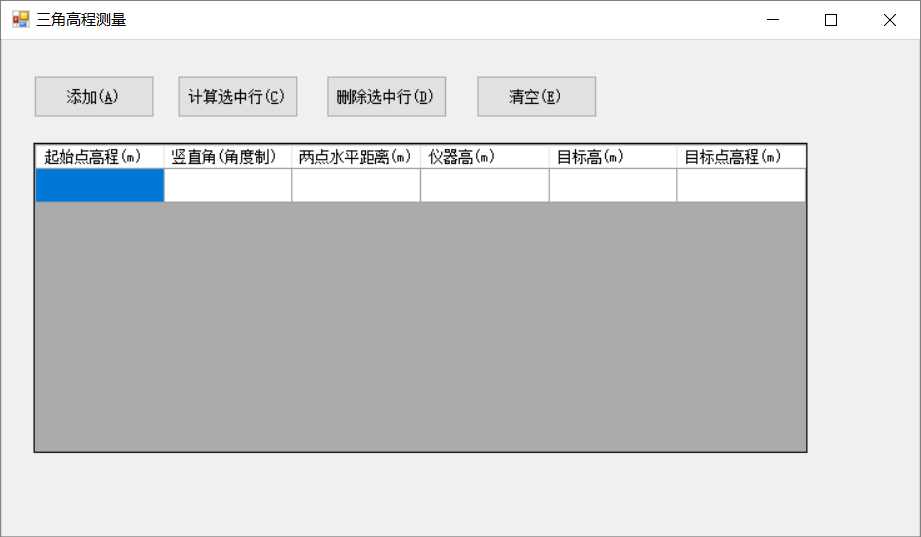
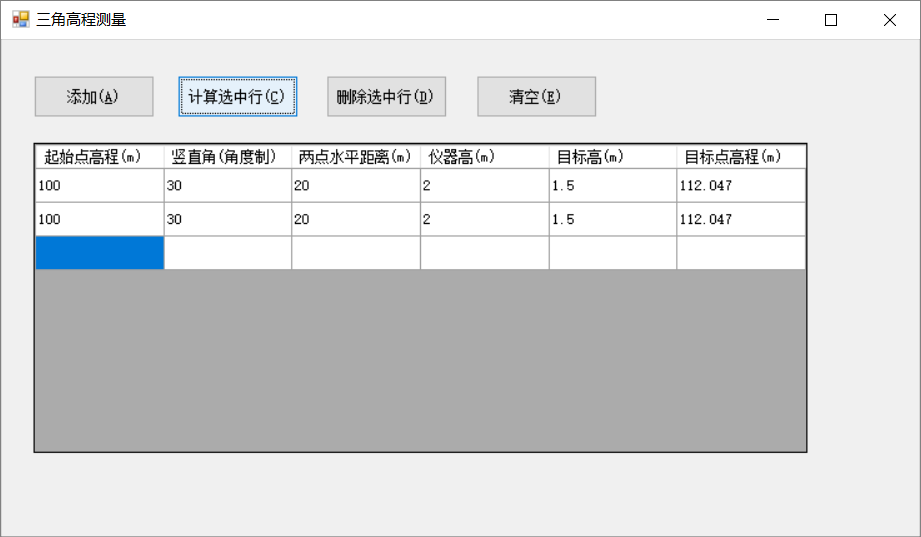
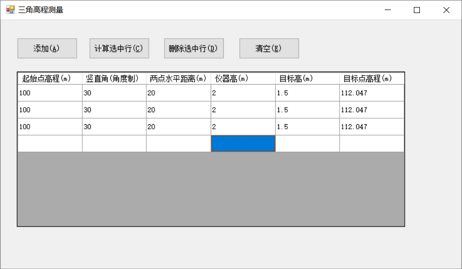
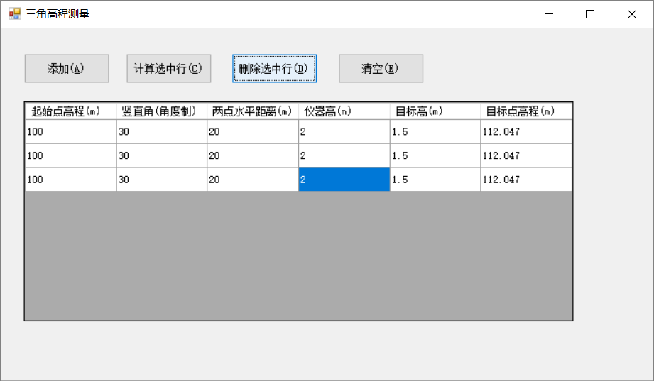
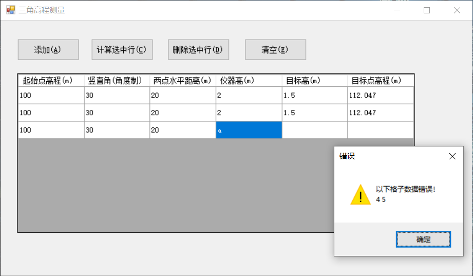

# 三角高程数据处理
在数据处理的时候，每一行中，为了使得结果不被修改，所以目标点高程设置为只读，不能被修改。

## 起始界面

## 添加
点击**添加**按钮（或者快捷键ALT+A),之后会在datagridview添加一行，为了防止用户误输入目标高程结果，所以目标高程设为只读，其他地方输入数据。

## 计算
点击**计算选中行**（或者快捷键ALT+C、回车键)，之后会计算用户选中的行的结果。  
为了防止误修改计算好的行，造成数据处理上的问题，选中的改行设置为只读。并且自动添加新的一行。  
  

## 删除
点击啥**删除选中行**（或者快捷键ALT+D），将会删除你选中的行。如果删除了所有的数据，那么将会自动添加新的一行，方便输入。
  

## 清空
点击**清空**按钮（或者快捷键ALT+E),将会清空当前的所有行。为了用户输入，将会自动添加新的一行，方便输入。

## 异常
当输入**无效格式**或者**数据为空**，则会弹出窗口提示重新输入。

## 快捷键汇总
1. 添加： alt+A
2. 计算： alt + C, 回车键
3. 删除： alt + D
4. 清空： alt + E