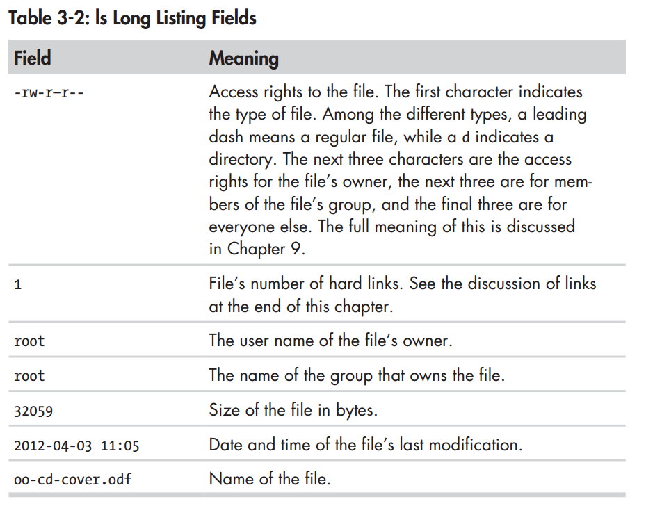

# Part 1:Learning Shell

## 1.What is Shell
---
#### Shell prompt
---
```sh
[me@linuxbox~]$
```
It will usually include your *username@machinename*, followed by current working directory and dolar sign($).  

If the last character of prompt is a hash sign(#) rather than dolar sign, the ternimal session has *superuser* privilleges.  

#### Command history
----
Press **up-arrow** key, we will see the history.

#### Cursor Movemoent
---
just press right/left-arrow keys, if current terminal remain some command.  

#### Mice and Focus
---
using double-clicking or holding down the left mouse button, you may select some highlight words, then, **pressing the middle mopuse button** will cause the text to be pasted.  
Do not use ctrl + C/V.  They don't work.

#### Date
---
```sh
wujing@ubuntu:~$ date
Thu May 24 01:07:55 PDT 2018
```
A related command is cal, that shows the calendar of current month.
```sh
wujing@ubuntu:~$ cal
      May 2018        
Su Mo Tu We Th Fr Sa  
       1  2  3  4  5  
 6  7  8  9 10 11 12  
13 14 15 16 17 18 19  
20 21 22 23 24 25 26  
27 28 29 30 31        
                   
```
To see the current amount of free space on your disk drives, enter **df**(it indicates disk free?):
```sh
wujing@ubuntu:~$ df
Filesystem     1K-blocks     Used Available Use% Mounted on
udev              982700        0    982700   0% /dev
tmpfs             201808     6376    195432   4% /run
/dev/sda1       18447100 13265832   4221168  76% /
tmpfs            1009040      212   1008828   1% /dev/shm
tmpfs               5120        4      5116   1% /run/lock
tmpfs            1009040        0   1009040   0% /sys/fs/cgroup
tmpfs             201808       52    201756   1% /run/user/1000
```

**free** memory:
```sh
$ free
```
```sh
$ exit
```
#### Help
```sh
$ man man df
```


#### Console Behind Curtain
---
Called *virtual terminals* or *virtual consoles* runs begind the **GUI**.These session can be accessed on Most Linux distribution by pressing **Ctrl-ALT-F6**.When accessed, it presents a login prompt, enter our username and password to switch from one virtual console to another, pass **ALT** and **F1-6**. To return to the graphic desktop, press **ALT-F7**.

## 2.Navigation
---
* pwd -Print working directory
* cd  -change directory
* ls  -list directory contents.
#### Firlsystem Tree
---
Linux organized its files in what it called a *hierarchical directory structure*, that means they are organized in a tree-like pattern of directories.  

The first directory in filesystem is called the *root directory*. The root contains files and subdirectories, and subdirectories contain more files and subdirectories...  
While Windows has a separete filesystem tree for each storage device, Unix-like systems such as Linux always have a single filesystem tree, regardless of how many drives or storage decixes are attched to the computer.  

Storage devices are *mounted*(just like attach) at various points on the tree according to the whims of the *system administrator*, the person responsible for the maintenace of the system.  

#### The Current Working Directory
---
*parent directory* is above *current working directory*.
```sh
wujing@ubuntu:~$ pwd
/home/wujing
```
First log in our system(or start a terminal), our current working directory is set to our *home directory*. Each user account is given its own home directory, which is the only place the user is allowed to wreite files when operating as a regular user.

#### Listing Contents
----
```sh
$ ls
```

#### Changing and Shortcuts
---
**cd ~ **  Changes to /home/username  
**cd - **  Changes working directory to the previous working directory  
**cd ~username**  Changes to home directory of username.


##### Absolute Pathnames
---
Absolute pathname begins with the root directory.
```sh
wujing@ubuntu:~$ cd /usr/bin
wujing@ubuntu:/usr/bin$ cd ~
wujing@ubuntu:~$
```
*/usr/bin* is full of files.

##### Relative Pathnames
---
It starts from working directory. By using **.** and **..** to perform it.  
Most of us know many usage on it, but note here:
```sh
wujing@ubuntu:/usr$ cd bin
wujing@ubuntu:/usr/bin$ 
```
You can omit the **./** because it is implied.

#### Filenames
---
1. Uses **ls -a** to list hidden file.
2. Case sensitive.Linux has no "file extension".

## 3.Exploring System
* **ls**  List directory contents.
* **file**  Determine file type.
* **less**  View file contents.

#### ls
---
1. **$ ls**
2. **$ ls /usr**  Specify the directory to list.
3. **$ ls ~ /usr**  List multiple directories.  
4. **$ ls -l**  Change format of the output to reveal more detail.long format

#### Options and Arguments
---
```sh
command -options arguments
```

GNU Project support *long options*, consisting of a word preceded by two dashes.  

the l option to produce
long format output, and the t option to sort the result by the file’s modification time:  
```sh
wujing@ubuntu:~$ ls -lt
```
We’ll add the long option --reverse to reverse the order of the sort:
```sh
wujing@ubuntu:~$ ls -lt --reverse
```

**Table:**


#### Long Format
```sh
total 60
drwxrwxr-x  2 wujing wujing 4096 May 24 01:59 ha
drwxr-xr-x  3 wujing wujing 4096 May  9 01:06 Desktop
drwxr-xr-x  2 wujing wujing 4096 May  6 21:26 Downloads
drwxrwxr-x 22 wujing wujing 4096 May  4 21:44 anaconda3
drwxrwxr-x 22 wujing wujing 4096 May  4 21:25 anaconda2
drwxrwxr-x  2 wujing wujing 4096 May  4 09:44 MyPrograms
drwxr-xr-x  2 wujing wujing 4096 May  4 09:22 Documents
drwxr-xr-x  2 wujing wujing 4096 May  4 09:22 Music
drwxr-xr-x  2 wujing wujing 4096 May  4 09:22 Pictures
drwxr-xr-x  2 wujing wujing 4096 May  4 09:22 Public
drwxr-xr-x  2 wujing wujing 4096 May  4 09:22 Templates
drwxr-xr-x  2 wujing wujing 4096 May  4 09:22 Videos
-rw-r--r--  1 wujing wujing 8980 May  4 09:13 examples.desktop
```


#### Determining File's Type with file
---
```sh
file filename
[me@linuxbox ~]$ file picture.jpg
picture.jpg: JPEG image data, JFIF standard 1.01
```
Then you know the filetype to ensure it is readable or a script etc.

#### Viewing File Contents with less
*scripts*, *configuration files*.  
```sh
wujing@ubuntu:~$ less '/home/wujing/Desktop/main.c' 
```

**table:**


**less is more.**

#### Tour
---
*symbolic link*, also known as a *soft link* or *symlimk*.  
A file can be referenced by multiple names.  

When the software updating, only instead of the old one such as *foo*, and use the new name to point it. *foo-2.6* -> foo, *foo-2.7* -> foo. So it allows us to keep both version on our machine.

#### Hard Links
---
The second type of link.

## 4.Manipulate Files and Directories
* **cp**—Copy files and directories.
* **mv**—Move/rename files and directories.
* **mkdir**—Create directories.
* **rm**—Remove files and directories.
* **ln**—Create hard and symbolic links.

#### Wildcards
---


  
Wildcards can be used with any command that accepts filenames as
arguments

#### Character Ranges
---
[a**-*], [A-Z], [0-9].
they will not produce the expected results unless properly configured. For now, you should avoid using them and use character classes instead.

#### mkdir—Create Directories
---
```sh
mkdir directory...
mkdir dir1 dir2 dir3
```

#### cp—Copy Files and Directories
---
copy files or directories.
```sh
cp item... directory
```
  
note the directory -r, when you need to copy directory, append it.


#### mv—Move and Rename Files
---
```sh
mv item1 item2
```
move or rename to files or directory item2.  


#### rm—Remove Files and Directories
---
Be careful with rm.  
**useful tip:**Whenever you use wildcards with rm (besides carefully
checking your typing!), test the wildcard first with ls.    
```sh
rm item...
```  

Use the *-i*, irm only works when you press *y/Y*.


#### ln—Create Links
---
hard link:only file.  
``sh
ln file link
```
symbolic link:
```sh
ln -s item link
```
If the file symbolic points to is deleted, list will show it in a disdinguishing color. Actually it points nothing.

Lile shortcut in Windows.

Ctrl + Shift + dragging to make link.

## 5.Working with Command
* **type**—Indicate how a command name is interpreted.
* **which**—Display which executable program will be executed.
* **man**—Display a command’s manual page.
* **apropos**—Display a list of appropriate commands.
* **info**—Display a command’s info entry.
* **whatis**—Display a very brief description of a command.
* **alias**—Create an alias for a command

#### Creating Your Own Commands with alias
---
Before alias used, we should use *type* to check whether our command existed.
```sh
wujing@ubuntu:~/Desktop$ type test
test is a shell builtin
wujing@ubuntu:~/Desktop$ type hehe
bash: type: hehe: not found
wujing@ubuntu:~/Desktop$ 
wujing@ubuntu:~/Desktop$ alias hehe='cd /usr;ls;cd -'
wujing@ubuntu:~/Desktop$ type hehe
hehe is aliased to 'cd /usr;ls;cd -'
wujing@ubuntu:~/Desktop$ unalias hehe
```

To see all the aliases defined in the environment, use the alias command without arguments.

## 6.Redirection
* **cat**—Concatenate files.
* **sort**—Sort lines of text.
* **uniq**—Report or omit repeated lines.
* **wc**—Print newline, word, and byte counts for each file.
* **grep**—Print lines matching a pattern.
* **head**—Output the first part of a file.
* **tail**—Output the last part of a file.
* **tee**—Read from standard input and write to standard output and files.

#### Redirecting Standard Output
---
we use the *>* redirection operator followed by the name of the file. 

stderr dose not send to stdout.  

we can use this to create new empty file.
```sh
$ > newfile
```

we use >> to avoid rewriting.  

#### Redirecting Stdandard Error
---
```sh
$ ls -l /usr/bin 2> ls-error.txt
```

#### Output to One File
---
```sh
$ ls -l /usr/bin > ls-output.txt 2>&1
```
stderr must always occur after stdin.

```sh
$ ls -l /usr/bin &> ls-output.txt
```
#### Disposing of Unwanted Output
---
```sh
$ ls -l /usr/bin 2> /dev/null
```

#### cat—Concatenate Files
---
You can use *cat* to display files withour paginf.
```sh
$ cat ls-output.txt
```

join multiple fille together.
```sh
$cat miview.mpeg.0* > movie.mpeg
$cat a b > c
```

if we enter cat with no argument, it reads from stdin, and we can redirect it.
```sh
cat > hehe.txt
```

redirect stdin:
```sh
$cat < d.txt
```

#### Piplines
---
Using the pipe
operator | (vertical bar), the standard output of one command can be piped
into the standard input of another.
```sh
%cat -l /usr/bin | less
```

#### Filters\ uniq—Report or Omit Repeated Lines
---

```sh
$ ls /bin /usr/bin | sort | less
```
```sh
$ ls /bin /usr/bin | sort | uniq | less

$ ls /bin /usr/bin | sort | uniq -d | less

```

#### wc—Print Line, Word, and Byte Counts
---
```sh
wujing@ubuntu:~/Desktop$ wc d.txt 
 2 10 44 d.txt
```

#### grep—Print Lines Matching a Pattern
---
grep pattern [file...]

Let’s say we want to find all the files in our list of programs that have the word zip in the name.  

```sh
wujing@ubuntu:~/Desktop$ ls -l /usr/bin | sort | uniq | grep zip
lrwxrwxrwx 1 root root           6 May  4 09:05 mzip -> mtools
-rwxr-xr-x 1 root root       10488 Feb  7  2016 prezip-bin
-rwxr-xr-x 1 root root      162688 Nov 20  2015 unzip
-rwxr-xr-x 1 root root      162688 Nov 20  2015 zipinfo
-rwxr-xr-x 1 root root      192520 Aug 16  2015 zip
-rwxr-xr-x 1 root root       22864 Nov 20  2015 funzip
-rwxr-xr-x 1 root root        2953 Nov 20  2015 zipgrep
-rwxr-xr-x 1 root root        3303 Aug 18  2016 gpg-zip
-rwxr-xr-x 1 root root       48459 Apr  5 05:48 zipdetails
-rwxr-xr-x 1 root root        5656 Feb  7  2016 preunzip
-rwxr-xr-x 1 root root        5656 Feb  7  2016 prezip
-rwxr-xr-x 1 root root       76592 Nov 20  2015 unzipsfx
-rwxr-xr-x 1 root root       81840 Aug 16  2015 zipnote
-rwxr-xr-x 1 root root       81840 Aug 16  2015 zipsplit
-rwxr-xr-x 1 root root       86224 Aug 16  2015 zipcloak
```

#### head/tail—Print First/Last Part of Files
---
The head command prints the first 10 lines of a file, and the tail command prints the last 10 lines. but this can be adjusted with the -n option:  

```sh
$ head -n 5 ls-output.txt
$ tail -n 5 ls-output.txt
```

These can be used in pipelines as well:
```sh
$ ls /usr/bin | tail -n 5
```
tail has an option that allows you to view files in real time. This is useful for watching the progress of log files as they are being written. 
```sh
$ tail -f /var/log/messages
```  
This continues until you type CTRL-C

#### tee—Read from Stdin and Output to Stdout and Files
---
“T” fitting on our pipe.  
The tee program reads standard input and copies it to both standard output. This is useful for capturing a pipeline’s contents at an intermediate stage of processing. 
  tee to capture the entire
directory listing to the file ls.txt before grep filters the pipeline’s contents:  
```sh
$ ls /usr/bin | tee ls.txt | grep zip
bunzip2
bzip2
gunzip
gzip
unzip
zip
zipcloak
zipgrep
zipinfo
zipnote
zipsplit
```
Two of pipline ouput data individually.

## 7.Seeing the World
* **echo**—Display a line of text.

```sh
$ echo *
Desktop Documents ls-output.txt Music Pictures Public Templates Videos
```

#### Pathname Expansion
---
```sh
echo D*
Desktop Documents
```

#### Tilde Expansion
---
```sh
$ echo ~foo
/home/foo
```

#### Arithmetic Expansion
---

$((expression))  

```sh
$ echo $((2 + 2))
4
```


#### Brace Expansion
---

```sh
$ echo Front-{A,B,C}-Back
Front-A-Back Front-B-Back Front-C-Back

$ echo Number_{1..5}
Number_1 Number_2 Number_3 Number_4 Number_5

$ echo {Z..A}
Z Y X W V U T S R Q P O N M L K J I H G F E D C B A

$ echo a{A{1,2},B{3,4}}b
aA1b aA2b aB3b aB4b

[me@linuxbox Pics]$ mkdir {2009..2011}-0{1..9} {2009..2011}-{10..12}
[me@linuxbox Pics]$ ls
2009-01 2009-07 2010-01 2010-07 2011-01 2011-07
2009-02 2009-08 2010-02 2010-08 2011-02 2011-08
2009-03 2009-09 2010-03 2010-09 2011-03 2011-09
2009-04 2009-10 2010-04 2010-10 2011-04 2011-10
2009-05 2009-11 2010-05 2010-11 2011-05 2011-11
2009-06 2009-12 2010-06 2010-12 2011-06 2011-12
```

#### Parameter
---

```sh
wujing@ubuntu:~/Desktop/pic$ echo $USER
wujing
```

To see more enviornment:
```sh
wujing@ubuntu:~/Desktop/pic$ printenv | less
```

#### Command Substitution
---
Command substitution allows us to use the output of a command as an expansion:
```sh
[me@linuxbox ~]$ echo $(ls)
Desktop Documents ls-output.txt Music Pictures Public Templates Videos
```