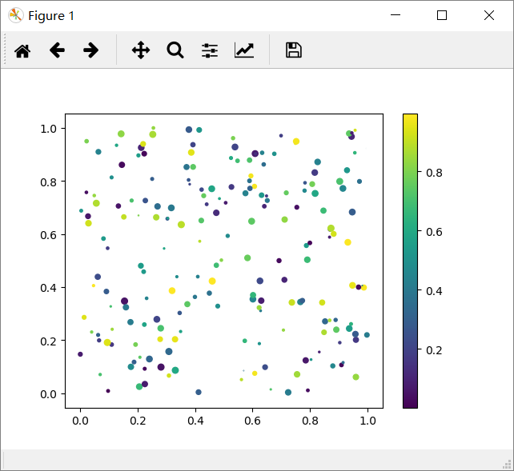
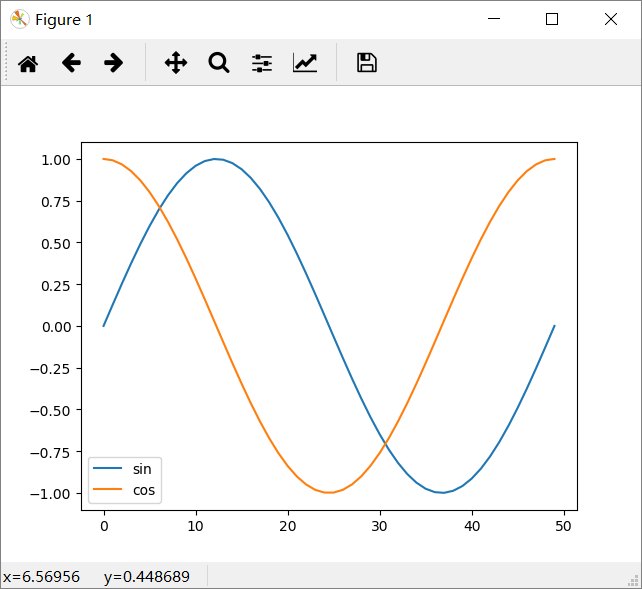
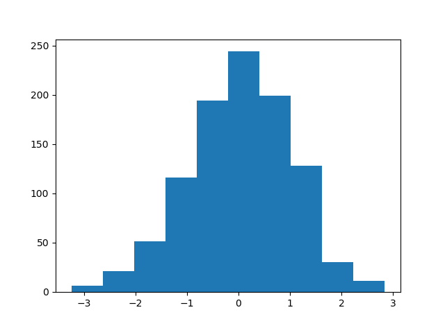

# Matplotlib 基础
内容：  
[显示网格](#显示网格)
# plot二维图
    plot(y)
    plot(x, y)
    plot(x, y, format_string)

## 简单的demo
    In [1]: import matplotlib.pyplot as plt

    In [2]: plt.plot([1, 2, 3])
    Out[2]: [<matplotlib.lines.Line2D at 0x22a1378e1d0>]

    In [3]: plt.ylabel('hehe')
    Out[3]: Text(0,0.5,'hehe')

    In [4]: plt.show()

## 使用魔术指令导入的操作
    In [1]: %pylab
    Using matplotlib backend: Qt5Agg
    Populating the interactive namespace from numpy and matplotlib

    In [2]: x = linspace(0, 2 * pi, 50)

    In [3]: plot(sin(x)) #这一步可以得到图像
    Out[3]: [<matplotlib.lines.Line2D at 0x1bea287c438>]

## 给定x和y
    plot(x, sin(x))

## 多条数据线
    plot(x, sin(x),
        x, sin(2 * x))
        
## 使用字符串，指定线条(format_string)
    plot(x, sin(x), 'r-^')

## 多线条，多指定format_string
    plot(x, sin(x, 'b-o',
        x, sin(2 * x), 'r-^')

## 散点图(scatter)
    scatter(x, y)
    scatter(x, y, size)
    scatter(x, y, size, color)

画二维散点图：

    In [4]: plot(x, sin(x), 'bo')
    Out[4]: [<matplotlib.lines.Line2D at 0x226a56b42b0>]
或者：

    In [5]: scatter(x, sin(x))
    Out[5]: <matplotlib.collections.PathCollection at 0x226a5d57908>
用法与MATLAB相似，可以添加大小，颜色参数。

    In [6]: x = rand(200)

    In [7]: y = rand(200)

    In [8]: size = rand(200) * 30

    In [9]: color = rand(200)

    In [10]: scatter(x, y, size, color)
    Out[10]: <matplotlib.collections.PathCollection at 0x226aa264ef0>

    In [11]: colorbar()
    Out[11]: <matplotlib.colorbar.Colorbar at 0x226aa283320>


## 多图（figure9())
    In [15]: y = cos(t)

    In [16]: figure()
    Out[16]: # 显示空白面板，继续在控制台编写<matplotlib.figure.Figure at 0x226a8fa00f0> 

    In [17]: plot(x)
    Out[17]: [<matplotlib.lines.Line2D at 0x226a905d748>]

    In [18]: figure()
    Out[18]: # 新的画布<matplotlib.figure.Figure at 0x226aa3ad748>

    In [19]: plot(y)
    Out[19]: [<matplotlib.lines.Line2D at 0x226aa8e7160>]

### 在一幅图中画子图
    subplot(row, column, index)

    In [20]: subplot(1, 2, 1)
    Out[20]: <matplotlib.axes._subplots.AxesSubplot at 0x226aa3c4550>

    In [21]: plot(x)
    Out[21]: [<matplotlib.lines.Line2D at 0x226aa3d4ef0>]

    In [22]: subplot(1, 2, 1)
    Out[22]: <matplotlib.axes._subplots.AxesSubplot at 0x226a8f91e48>

    In [23]: plot(x)
    Out[23]: [<matplotlib.lines.Line2D at 0x226ab184208>]

    In [24]: subplot(1, 2, 2)
    Out[24]: <matplotlib.axes._subplots.AxesSubplot at 0x226ab199518>

    In [25]: plot(y)
    Out[25]: [<matplotlib.lines.Line2D at 0x226ab05aba8>]

## 向图中添加数据
默认多次plot会叠加  
    In [26]: plot(x)
    Out[26]: [<matplotlib.lines.Line2D at 0x226ab07a8d0>]

    In [27]: plot(y)
    Out[27]: [<matplotlib.lines.Line2D at 0x226ab087668>]
可以用**hold（False)**关掉，向MATLAB  

    In [29]: plot(x)
    Out[29]: [<matplotlib.lines.Line2D at 0x226ab0cbf98>]

    In [30]: hold(False)
    In [31]: plot(y)
    Out[31]: [<matplotlib.lines.Line2D at 0x226ab0a6b38>]

## 标签(label)
```python
In [38]: plot(x, label='sin')
Out[38]: [<matplotlib.lines.Line2D at 0x226ac4b34e0>]

In [39]: plot(y, label='cos')
Out[39]: [<matplotlib.lines.Line2D at 0x226ac4d79e8>]

In [40]: legend()
Out[40]: <matplotlib.legend.Legend at 0x226ac4e8940>
```

或者直接在**legend**直接输入：

    In [41]: plot(x)
    Out[41]: [<matplotlib.lines.Line2D at 0x226ac535208>]

    In [42]: plot(y)
    Out[42]: [<matplotlib.lines.Line2D at 0x226ac55a9e8>]

    In [43]: legend(['sin', 'cos'])
    Out[43]: <matplotlib.legend.Legend at 0x226ace606d8>

## 坐标轴，标题，网格

###坐标label
    In [45]: xlabel('radians')
    Out[45]: Text(0.5,23.1922,'radians')

    In [46]: ylabel('amplitude', fontsize='large')
    Out[46]: Text(22.3472,0.5,'amplitude')

    In [47]: title('Sin(x)')
    Out[47]: Text(0.5,1,'Sin(x)')

### 显示网格(grid())
```py
plot(x, sin(x))
xlabel('radians')
ylabel('amplitude', fontsize='large')
title('Sin(x)')
grid()
```

## 清楚、关闭图像

### 清除已有的图像
```py
clf()
```

### 关闭当前图像
```py
close()
```

### 关闭所有图像
```py
close('all')
```

## imshow显示图片
```py
# 导入lena图片
from scipy.misc import lena
img = lena()
img #显示array类型对象
```
使用**imshow()**显示图片数据：
```py

imshowimshow((imgimg,,
               # 设置坐标范围
      extent = [-25, 25, -25, 25],
       # 设置colormap
      cmap = cm.bone)
colorbar()
```

## 直方图
从高斯分布随机生成1000个点得到的直方图：
```py
In [30]:
hist(randn(1000))
Out[30]:
(array([   2.,    7.,   37.,  119.,  216.,  270.,  223.,   82.,   31.,   13.]),
 array([-3.65594649, -2.98847032, -2.32099415, -1.65351798, -0.98604181,
        -0.31856564,  0.34891053,  1.0163867 ,  1.68386287,  2.35133904,
         3.01881521]),
 <a list of 10 Patch objects>)
 ```
 